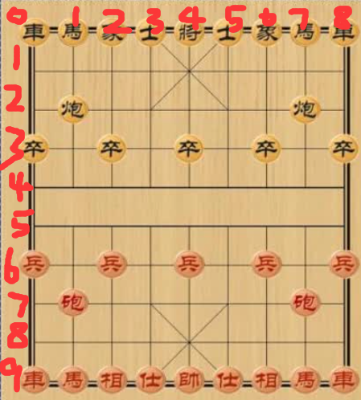
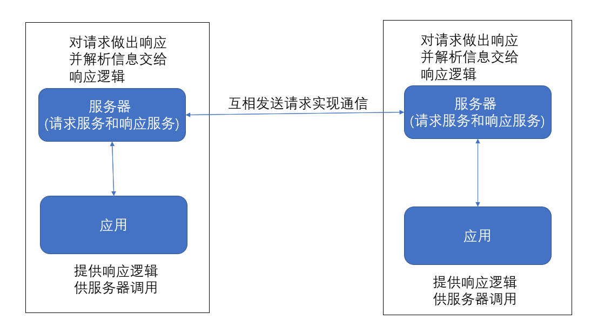
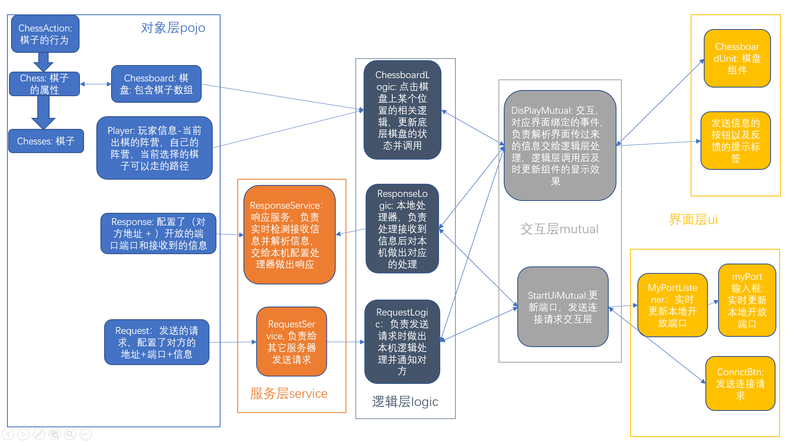
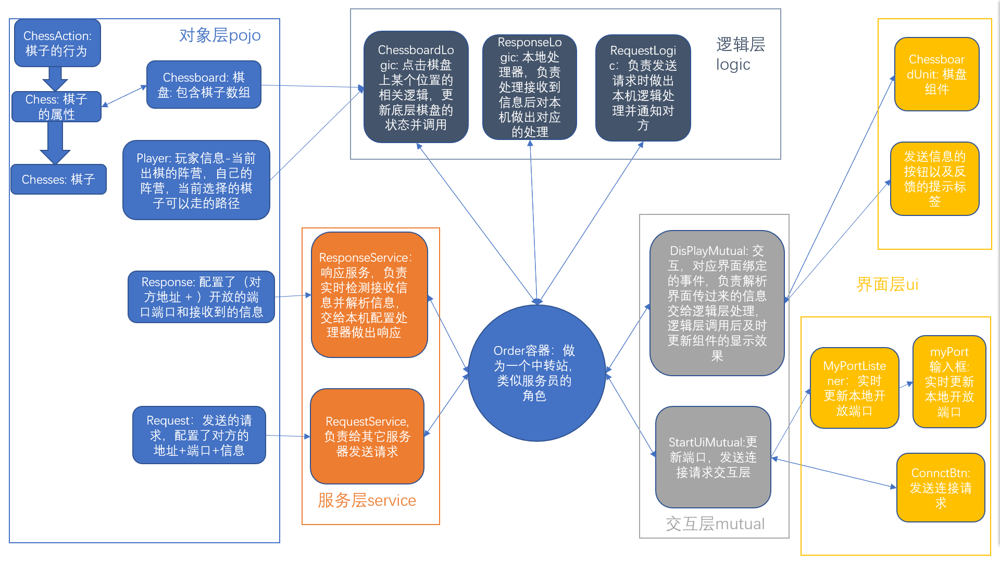

# 棋盘界面

如图

# 项目结构介绍

### 多设备通信原理

每个应用都开了一个本地服务器线程来实现多设备通信，在项目中有两个服务，请求服务和响应服务，这两个服务构成了一个简易的服务器，通信具体过程如下图

### 架构设计

项目分为五层，分别为对象层，服务层，逻辑层，交互层，界面层，如下图所示

它们的功能如下：

* 对象层: 封装了一些逻辑层会用到的对象，例如棋盘，棋子，玩家
* 服务层: 通信服务，包括请求和响应两个服务，负责多设备通信，构成一个简易的本地服务器
* 逻辑层: 做一些相对复杂的工作，比如棋的移动逻辑
* 交互层: 负责界面层与逻辑层的交互
* 界面层: 显示的界面

### 简化

其中服务层，逻辑层，交互层的关系比较复杂，是多对多的关系，不方便相互使用，如果要相互使用的话，每个里面都要创建对方的类型的实例来存对象，这样一下就多了特别多属性(字段)，使用起来比较麻烦。为了简化使用逻辑，这里使用一个中转站Order类来进行管理，使其变成了一对多和多对一的关系，简化了编程难度，如下图

这样来看就简单了许多了，Order充当一个服务员的角色。比如你是一个顾客，你想要找厨师，你直接找服务员就可以了，避免了冗余的寻找过程。

### 流程举例

举一个例子，玩家移动一颗棋子的流程如下：

1. 界面层通知交互层有点击事件发生
2. 交互层计算点击所在位置的棋子下标，告诉棋盘逻辑类去处理
3. 棋盘逻辑类根据具体情况(是否是当前出棋的阵营)判断是否能移动棋子
4. 如果可以移动棋子，通知通信逻辑类来处理棋子移动和告诉对方设备
5. 通信逻辑类先处理移动棋子相关的事件(移动，更换出棋阵营，记录移动路径方便悔棋时使用等)，处理完后给对方设备发特定的请求，然后通知交互层刷新界面
6. 对方设备的响应监听线程监听到请求，格式化各种参数后，根据接收到的请求里的特定的标志，通知响应逻辑类使用特定的方法（函数）来处理这个响应
7. 响应逻辑类使用棋盘逻辑类的各个功能来处理移动棋子的事件(移动，更换出棋阵营，记录移动路径方便悔棋时使用等)，然后通知交互层刷新界面

# 程序入口目录(main文件夹)

* 运行OneWindow类 只创建一个窗口，用于和其它设备通信
* 运行TwoWindow类 创建两个一样的窗口，用于本机测试

# 项目目录结构(code文件夹)

### img文件夹:

存放资源图片的文件夹

### pojo文件夹:

对应上面架构介绍中提到的对象层

* ChessAction 接口: 定义了棋子可能的行为(方法)
* Chess 类: implement ChessAction, 做为所有棋子的父类，定义了棋子的一些属性(字段)
* chesses 文件夹: 有各种棋子类， 里面的类都继承Chess类, 都实现了ChessAction接口里定义的方法
* ChessBoard 类: 棋盘类, 里面有一个Chess类二维数组提供游戏界面底层逻辑实现需要操控的对象
* Response 类: 通信信息类，用作接收信息，里面定义了端口和地址信息
* Request 类: 通信信息类，用作发送信息，里面定义了端口和地址信息
* Player 类: 玩家类，包含阵营信息等
* Position 类: 位置类，定义了一些坐标信息

### logic文件夹:

对应上面架构介绍中提到的逻辑层

* ChessBoardLogic: 棋盘游戏服务，实现了游戏的相关逻辑
* RequestLogic: 请求逻辑类，里面定义了发送特定请求时该如何处理事务
* ResponseLogic: 响应逻辑类，里面定义了接到到特定请求时该如何做出响应

### ui 文件夹:

对应上面架构中介绍中提到的界面层

1. 窗口
* StartUi: 选择ip地址和端口的界面
* DisplayUi: 游戏界面，包含一个棋盘界面和其它的按钮标签等
2. 组件
* ChessBoardUi: 棋盘界面，实现了象棋逻辑的一张画布
* PortInput: 输入框，限制只能输入数字，范围为 1-65536
3. 监听器
* PortAndIpListener: 实现在输入框上输入时实时绑定对应端口和ip地址
4. mutual 文件夹：对应上面架构中介绍中提到的交互层
* StartUiMutual类，负责开始界面的交互
* DisplayUiMutual类，负责游戏进行时界面的交互
* ChessBoardUiMutual类，负责棋盘界面的交互

### service文件夹：

对应上面架构中介绍中提到的服务层

* RequestService 请求服务，负责发送请求
* ResponseService 响应服务，负责接收请求和做出响应

### utils 文件夹:

里面包含一些工具类, 把那些重复的操作提取出来封装成静态方法

* ChessboardUtils: 棋盘界面工具，主要作用是根据提供的信息计算界面大小
* ChessUtils: 棋子工具, 主要作用是实现了一些棋子会重复用到的逻辑，比如判断越界，某个位置是否存在棋子等
* CommUtils: 通信工具，主要实现了通信相关的静态方法
* MsgUtils: 信息处理工具，发送时用来格式化信息，接收时用来解析信息
* UiUtils: 界面工具， 主要作用是图片读取和放缩到指定大小的功能